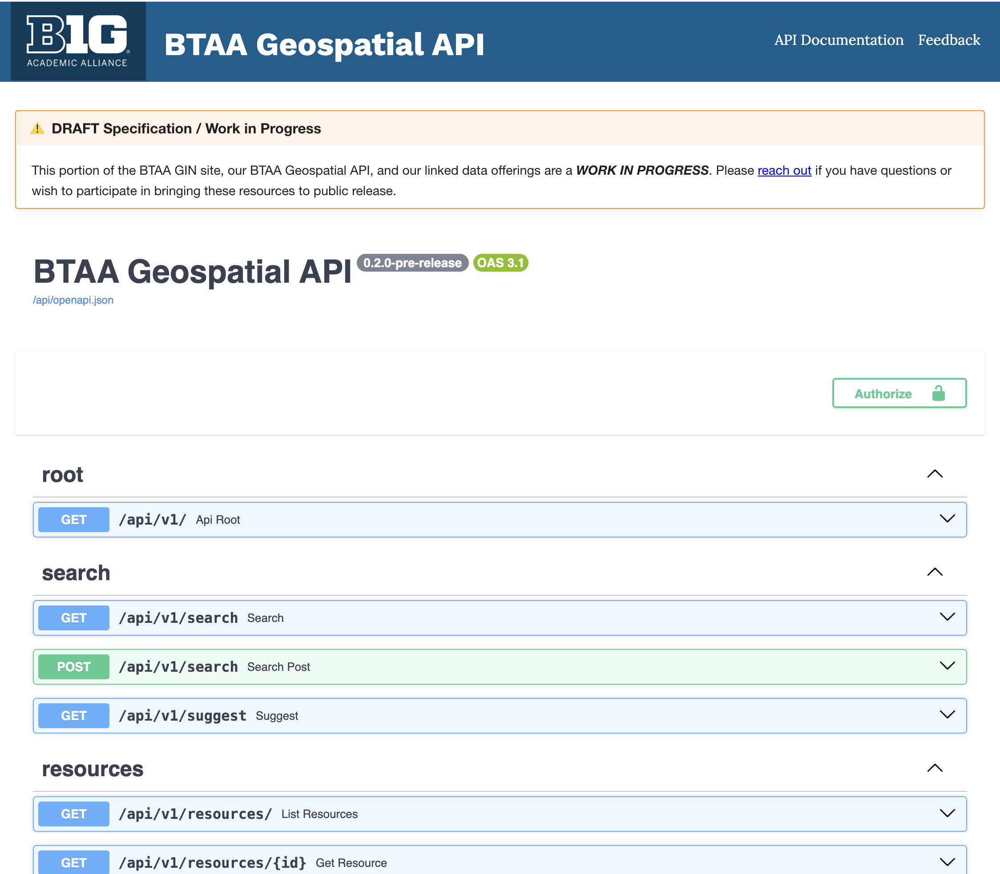

# BTAA Geospatial API



## Development

Install dependencies using `uv` (recommended):
```bash
# Install uv if you haven't already
curl -LsSf https://astral.sh/uv/install.sh | sh

# Create and activate a virtual environment
uv venv
source .venv/bin/activate

# Install dependencies
uv pip install -e .

# For development dependencies (including testing and linting tools)
uv pip install -e ".[dev]"
```

To generate or update the lockfile:
```bash
uv pip compile pyproject.toml -o uv.lock
```

To install dependencies from the lockfile:
```bash
uv pip install --requirements uv.lock
```

The default settings should work for local development, but if you need to tweak the environment variables, you can do so by copying the `.env.example` file to `.env` and making your changes.

```bash
cp .env.example .env
```

Run the Docker containers:

The application uses several services:

* [ParadeDB](https://www.paradedb.com/) (PostgreSQL-compatible database)
  - Port: 2345
  - Default credentials: postgres/postgres
  - Database: btaa_geospatial_api

* [Elasticsearch](https://www.elastic.co/elasticsearch/) (Search engine)
  - Port: 9200
  - Single-node configuration
  - Security disabled for development
  - 2GB memory allocation
  - Index: btaa_geospatial_api

* [Redis](https://redis.io/) (Caching and message broker)
  - Port: 6379
  - Persistence enabled
  - Used for API caching and Celery tasks

* [DuckDB](https://duckdb.org/) (Embedded analytical database)
  - Runs in-process with the Python application
  - No separate service or port required
  - Database file: `data/duckdb/btaa_geospatial_api.duckdb`
  - Used for analytical queries and data processing
  - Access via Python `duckdb` package

* [Celery Worker](https://docs.celeryq.dev/) (Background task processor)
  - Processes asynchronous tasks
  - Connected to Redis and ParadeDB
  - Logs available in ./logs directory

* [Flower](https://flower.readthedocs.io/) (Celery monitoring)
  - Port: 5555
  - Web interface for monitoring Celery tasks
  - Access at http://localhost:5555

* [Nginx](https://nginx.org/) (Reverse proxy - development only)
  - Port: 8080
  - Reverse proxy that sits in front of the API
  - Sets `X-Forwarded-For` headers for proper IP address detection
  - Required for API key IP whitelist functionality in development
  - Access API through nginx at http://localhost:8080
  - Direct API access still available at http://localhost:8000
  - **Note**: This is development-only and does not affect production deployments (Kamal uses Traefik)

Start all services:
```bash
docker compose up -d
```

Imports a flat file of GeoBlacklight OpenGeoMetadata Aardvark test fixture data:
```bash
cd data
psql -h localhost -p 2345 -U postgres -d btaa_geospatial_api -f btaa_geospatial_api.txt
```

Run the API server:
```bash
uvicorn main:app --reload
```

## Run the Database migrations

This script will create all the database tables needed for the application.

```bash
.venv/bin/python run_migrations.py
```

## Run the Item Relationships

This script will populate the item_relationships triplestore.

```bash
.venv/bin/python scripts/populate_relationships.py
```

## Run the Elasticsearch index

This script will create and populate the application ES index.

```bash
.venv/bin/python run_index.py
```

## Run the Gazetteers

This script will download and import all the gazetteer data.

```bash
.venv/bin/python run_gazetteers.py
```

## Docker Hub

The application is also available as a Docker image on Docker Hub. You can pull and run the image using the following commands:

```bash
docker pull ewlarson/btaa-geospatial-api:latest
docker run -d -p 8000:8000 ewlarson/btaa-geospatial-api:latest
```

This will start the API server on port 8000.

## API Access

### Development Setup

The API is accessible in multiple ways during development:

1. **Via Nginx BFF Proxy (Recommended for React apps)**
   - URL: http://localhost:8080/api-proxy/*
   - Example: `http://localhost:8080/api-proxy/search?q=test`
   - Automatically adds API key server-side (hidden from browser)
   - Sets `X-Forwarded-For` headers correctly
   - **Use this for client-side React applications** - API key is never exposed
   - Requires `BTAA_GEOSPATIAL_API_KEY` environment variable in `.env` file

2. **Via Nginx Direct Proxy (For backward compatibility)**
   - URL: http://localhost:8080/*
   - Example: `http://localhost:8080/api/v1/search?q=test`
   - Sets `X-Forwarded-For` headers correctly
   - Does NOT add API key automatically
   - Use for admin endpoints or when you want to pass your own API key

3. **Direct API Access**
   - URL: http://localhost:8000
   - Useful for admin endpoints and testing
   - Does not set `X-Forwarded-For` headers (IP whitelist may not work as expected)

**Note**: In production, Traefik (configured via Kamal) handles reverse proxy functionality and sets `X-Forwarded-For` headers automatically.

### Setting Up the BFF Proxy

To use the BFF proxy (recommended for React apps), add your API key to your `.env` file:

```bash
BTAA_GEOSPATIAL_API_KEY=your-api-key-here
```

Then restart nginx:
```bash
docker compose restart nginx
```

Your React app should call:
```typescript
// Instead of: fetch('http://localhost:8000/api/v1/search?q=test')
// Use:
fetch('http://localhost:8080/api-proxy/search?q=test')
```

The API key will be automatically added server-side and never exposed to the browser.

## Endpoints

### GET /docs

[http://localhost:8000/docs](http://localhost:8000/docs) or [http://localhost:8080/docs](http://localhost:8080/docs)

Returns the API documentation.

## Caching

The API supports aggressive Redis-based caching to improve performance. Caching can be controlled through environment variables:

```
# Enable/disable caching
ENDPOINT_CACHE=true

# Redis connection settings
REDIS_HOST=redis
REDIS_PORT=6379
REDIS_PASSWORD=optional_password
REDIS_DB=0

# Cache TTL settings (in seconds)
DOCUMENT_CACHE_TTL=86400  # 24 hours
SEARCH_CACHE_TTL=3600     # 1 hour
SUGGEST_CACHE_TTL=7200    # 2 hours 
LIST_CACHE_TTL=43200      # 12 hours
CACHE_TTL=43200           # Default TTL (12 hours)

# Rate Limiting settings
RATE_LIMIT_ENABLED=true   # Enable/disable rate limiting
RATE_LIMIT_REDIS_DB=2     # Redis database number for rate limiting (uses same Redis instance)

# API Usage Analytics Enrichment (User Agent Parsing)
# Note: Geocoding has been removed due to licensing complexity
```

When caching is enabled:
- API responses are cached in Redis based on the endpoint and its parameters
- Search results are cached for faster repeated queries
- Resource details are cached to reduce database load
- Suggestions are cached to improve autocomplete performance

The cache is automatically invalidated when:
- Resources are created, updated, or deleted
- The Elasticsearch index is rebuilt

You can manually clear the cache using:
```
GET /api/v1/cache/clear?cache_type=search|resource|suggest|all
```

## API Usage Analytics

The API automatically logs all requests to the `api_usage_logs` table for analytics purposes. This includes:

- Request metadata (endpoint, method, status code, response time)
- API key and tier information
- IP address and user agent
- Referrer and UTM parameters
- Query parameters (stored in JSON properties field)

### Service tiers, API keys, and rate limiting

The public API supports **service tiers** and **API key–based rate limiting**.

- **Service tiers** are defined in the `api_service_tiers` table and seeded by the migrations into tiers such as:
  - `btaa_primary` / `btaa_secondary` – internal BTAA applications with unlimited access
  - `btaa_member_primary` / `btaa_member_affiliated` – member applications with higher limits
  - `general_registered` – registered external users
  - `anonymous` – unauthenticated access with the lowest limits
- **API keys** are stored (hashed) in the `api_keys` table and associated with a tier.
- **Rate limits** are enforced per tier, per identifier (API key hash or IP address) using Redis.

#### How clients authenticate

Clients can authenticate with an API key in one of three ways (in order of precedence):

- `X-API-Key` header:

  ```http
  X-API-Key: your-api-key-here
  ```

- `Authorization` header with Bearer token:

  ```http
  Authorization: Bearer your-api-key-here
  ```

- `api_key` query parameter:

  ```text
  GET /api/v1/search?q=roads&api_key=your-api-key-here
  ```

If no valid API key is provided, the request is treated as **anonymous** and uses the anonymous tier’s rate limit.

#### Admin API for managing keys and tiers

Admin users (protected by HTTP Basic auth with `ADMIN_USERNAME` / `ADMIN_PASSWORD`) can manage keys and inspect tiers:

- `POST /api/v1/admin/api-keys` – create a new API key for a given `tier_name`.
  - Request body: `{ "tier_name": "anonymous", "name": "optional friendly name" }`
  - Response includes the **plaintext** `api_key` once, plus `key_id` and `tier_name`.
- `GET /api/v1/admin/api-keys` – list existing keys and their tiers.
- `PATCH /api/v1/admin/api-keys/{key_id}` – update `tier_name`, `is_active`, or `name`.
- `DELETE /api/v1/admin/api-keys/{key_id}` – revoke (deactivate) a key.
- `GET /api/v1/admin/api-tiers` – list all tiers, limits, and descriptions.

The admin endpoints are intended for trusted operators only; do **not** expose them directly to the public internet without appropriate protections (e.g., network restrictions, stronger auth).

#### Rate limiting behavior

Rate limiting is enforced by middleware in front of all non-admin API routes:

- Configuration is controlled via environment variables:

  ```text
  RATE_LIMIT_ENABLED=true     # Enable/disable rate limiting middleware
  RATE_LIMIT_REDIS_DB=2       # Redis database used for rate limiting
  REDIS_HOST=redis            # Redis host
  REDIS_PORT=6379             # Redis port
  REDIS_PASSWORD=optional_password
  ```

- For each request, the middleware:
  - Resolves the caller’s **tier** from the API key (if provided) or falls back to the `anonymous` tier.
  - Uses Redis to track the number of requests per minute per `(tier_name, identifier)`, where `identifier` is the API key hash or client IP (via `X-Forwarded-For` or socket address).
  - Enforces the tier’s `requests_per_minute` limit.

When rate limiting is enabled, responses include:

- `X-RateLimit-Limit` – the allowed number of requests per minute for the current tier (or `unlimited`).
- `X-RateLimit-Remaining` – remaining requests in the current window (or `unlimited`).
- `X-RateLimit-Reset` – UNIX timestamp when the window resets.

If a client exceeds its rate limit:

- The API returns **HTTP 429 Too Many Requests** with a JSON body describing the error.
- The response includes `Retry-After` and `X-RateLimit-*` headers indicating when to retry.

### Enrichment with User Agent Parsing

API usage logs are automatically enriched in the background with:

- **User agent parsing**: Browser, operating system, and device type

This enrichment happens asynchronously via Celery tasks to avoid blocking API requests.

**Note**: IP geocoding (country, region, city, latitude, longitude) has been removed due to licensing complexity with geocoding databases.

#### Backfilling Enrichment Data

To enrich existing API usage logs that were created before enrichment was enabled, you can use the batch enrichment task:

```python
from app.tasks.api_usage_enrichment import enrich_api_usage_logs_batch

# Enrich 100 logs at a time
enrich_api_usage_logs_batch.delay(batch_size=100)
```

This can be run repeatedly until all logs are enriched.

## AI Summarization

The API uses OpenAI's ChatGPT API to generate summaries and identify geographic named entities of historical maps and geographic datasets. To use this feature:

1. Set your OpenAI API key in the `.env` file:
```
OPENAI_API_KEY=your_openai_api_key_here
OPENAI_MODEL=gpt-3.5-turbo
```

2. The summarization service will automatically use this API key to generate summaries.
3. The geo_entities service will use the same API to identify and extract geographic named entities from the content.

### Supported Asset Types

The API can process various types of assets to enhance summaries:

- **IIIF Images**: Extracts metadata and visual content from IIIF image services
- **IIIF Manifests**: Processes IIIF manifests to extract metadata, labels, and descriptions
- **Cloud Optimized GeoTIFFs (COG)**: Extracts geospatial metadata from COG files
- **PMTiles**: Processes PMTiles assets to extract tile information
- **Downloadable Files**: Processes various file types (Shapefiles, Geodatabases, etc.)

### Generating Summaries

To generate a summary for a resource:

```
POST /api/v1/resources/{id}/summarize
```

This will trigger an asynchronous task to generate a summary. You can retrieve the summary using:

```
GET /api/v1/resources/{id}/summaries
```

### Geographic Entity Extraction

The API can identify and extract geographic named entities from resources. This includes:

- Place names
- Geographic coordinates
- Administrative boundaries
- Natural features
- Historical place names

To extract geographic entities:

```
POST /api/v1/resources/{id}/extract_entities
```

The response will include:
- Extracted entities with confidence scores
- Geographic coordinates when available
- Links to gazetteer entries
- Historical context when relevant

### Future Enhancements

The following AI features are planned:

- Metadata summaries
- Imagery summaries
- Tabular data summaries
- OCR text extraction
- Subject enhancements

## Colophon

### Gazetteers

#### BTAA Spatial Metadata

Data from BTAA GIN. @TODO add license.

#### GeoNames

Data from GeoNames. [License - CC BY 4.0](https://creativecommons.org/licenses/by/4.0/)

#### OCLC FAST Geographic

Data from FAST (Faceted Application of Subject Terminology) which is made available by OCLC Online Computer Library Center, Inc. under the [License - ODC Attribution License](https://www.oclc.org/research/areas/data-science/fast/odcby.html).

#### Who's On First

Data from Who's On First. [License](https://whosonfirst.org/docs/licenses/)

## TODO

- [X] Docker Image - Published on Docker Hub
- [X] Search - basic search across all text fields
- [X] Search - autocomplete
- [X] Search - spelling suggestions
- [X] Search - more complex search with filters
- [X] Search - pagination
- [X] Search - sorting
- [X] Search - basic faceting
- [X] Performance - Redis caching
- [X] Search - facet include/exclude
- [X] Search - facet alpha and numerical pagination, and search within facets
- [X] Search - advanced/fielded search
- [X] Search - spatial search
- [X] Search Results - thumbnail images (needs improvements)
- [X] Search Results - bookmarked resources
- [X] Item View - citations
- [X] Item View - downloads
- [X] Item View - relations (triplestore)
- [ ] Item View - exports (Shapefile, CSV, GeoJSON)
- [ ] Item View - export conversions (Shapefile to: GeoJSON, CSV, TSV, etc)
- [ ] Item View - code previews (Py, R, Leaflet)
- [ ] Item View - embeds
- [X] Item View - allmaps integration (via embeds)
- [ ] Item View - data dictionaries
- [ ] Item View - web services
- [ ] Item View - metadata
- [ ] Item View - related resources (vector metadata search)
- [ ] Item View - similar images (vector imagery search)
- [ ] Collection View
- [ ] Place View
- [X] Gazetteer - BTAA Spatial
- [X] Gazetteer - Geonames
- [X] Gazetteer - OCLC Fast (Geographic)
- [X] Gazetteer - Who's on First
- [ ] Gazetteer - USGS Geographic Names Information System (GNIS), needed?
- [ ] GeoJSONs
- [X] AI - Metadata summaries
- [X] AI - Geographic entity extraction
- [ ] AI - Subject enhancements
- [ ] AI - Imagery - Summary
- [ ] AI - Imagery - OCR'd text
- [ ] AI - Tabular data summaries
- [ ] API - Analytics (PostHog?)
- [ ] API - Authentication/Authorization for "Admin" endpoints
- [ ] API - Throttling
- [X] Heirarchical Faceting > Spatial, ex: https://geo.btaa.org/catalog/p16022coll230:1750