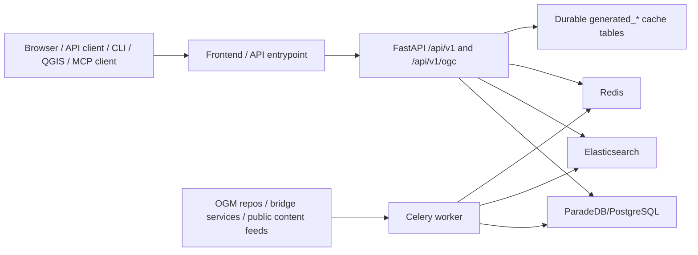

# BTAA Geospatial API Documentation

This directory is the public repository handbook for the BTAA Geospatial API
platform. It covers local development, architecture, testing, public API
behavior, and code-oriented maintenance.

Detailed deployment, host, secret, backup, incident, capacity, and production
operations live in restricted operations documentation and are intentionally not
published here. See [security_docs_policy.md](security_docs_policy.md) for the
classification rules.

## Onboarding Path

1. Start with [development.md](development.md) to run the local stack.
2. Read [backend/codebase_overview.md](backend/codebase_overview.md) for the
   system architecture.
3. Use [make_tasks.md](make_tasks.md) for safe local command references.
4. Use [backend/testing.md](backend/testing.md) and
   [frontend/testing.md](frontend/testing.md) before changing behavior.
5. Use [backend/ogm_harvesting.md](backend/ogm_harvesting.md),
   [backend/search.md](backend/search.md), and related backend docs for
   implementation details.
6. Use the deployment, recovery, analytics, Slack, and performance pages here as
   public stubs only. Full procedures are restricted operations material.

## Project Folders

| Path | Purpose |
| --- | --- |
| `backend/` | FastAPI app, API routers, service layer, SQLAlchemy table metadata, database migrations, Celery tasks, ingest/index scripts, backend tests, templates, and static API docs assets. |
| `frontend/` | React / React Router / TypeScript public discovery interface, Vite tooling, component tests, accessibility checks, styling, and browser assets. |
| `cli/` | Python command-line client for searching, reading schemas/facets, fetching resources, validating Aardvark, and using OGC routes. |
| `qgis-plugin/` | QGIS desktop plugin for catalog search and map-loading workflows. |
| `mcp/` | Model Context Protocol helpers and local client configuration templates. |
| `mkdocs/` | Public MkDocs Material site for external API specification, linked data, and tutorials. |
| `docs/` | Public repository handbook, safe architecture notes, local development docs, and restricted-topic stubs. |
| `config/` | Runtime and deployment configuration. Detailed deployed-environment procedures are restricted. |
| `performance/` | k6 harness assets. Detailed capacity reports are restricted. |
| `data/`, `logs/`, `tmp/` | Local runtime volumes and generated artifacts. Treat these as environment state. |

## Technology Architecture

The application is a monorepo with a browser app, public API, background
workers, search index, relational store, cache, and auxiliary client tooling.



Core runtime technologies:

| Layer | Current implementation |
| --- | --- |
| API | FastAPI app mounted at `/api/v1`, with Swagger at `/api/docs` and OpenAPI JSON at `/api/openapi.json`. |
| Public web app | React, React Router, TypeScript, Vite, MUI, Leaflet, GeoBlacklight frontend components, and H3 map visualization. |
| Search | Elasticsearch with versioned index builds and alias swaps through `scripts/reindex_atomic.py`. |
| Database | ParadeDB/PostgreSQL, SQLAlchemy table metadata in `backend/db/models.py`, script-based migrations in `backend/db/migrations/`. |
| Cache | Redis plus durable database caches for generated API responses, resource representations, and visual assets. |
| Jobs | Celery worker with Redis broker/result backend; Flower for local monitoring. |
| Public docs | MkDocs Material under `mkdocs/`, served locally with `make docs-serve` and built with `make docs-build`. |

## Local Docker Stack

The local stack is defined in `docker-compose.yml`.

| Service | Role |
| --- | --- |
| `api` | FastAPI app, API docs, sitemap/robots, static docs assets. |
| `frontend` | React Router dev server with mounted source files. |
| `elasticsearch` | Local search index. |
| `paradedb` | Local PostgreSQL/ParadeDB database. |
| `redis` | Local cache, locks, Celery broker, and rate-limit support. |
| `celery_worker` | Background ingest, indexing, bridge, thumbnail, static-map, and cache tasks. |
| `flower` | Local Celery monitoring UI. |

Start and stop:

```bash
cp .env.example .env
docker compose up -d
docker compose down
```

Local URLs:

- Frontend: `http://localhost:3000`
- API docs: `http://localhost:8000/api/docs`
- OpenAPI JSON: `http://localhost:8000/api/openapi.json`
- Flower: `http://localhost:5555`

## Public API Surface

Canonical API prefixes:

- Public JSON:API-style routes: `/api/v1`
- OGC API - Records compatibility facade: `/api/v1/ogc`
- Swagger UI: `/api/docs`
- OpenAPI document: `/api/openapi.json`
- Sitemaps and robots: `/sitemap.xml`, `/sitemaps/{filename}.xml`,
  `/robots.txt`

Public-facing endpoint and parameter details should be kept in
`mkdocs/docs/specification/endpoints.md` and
`mkdocs/docs/specification/parameters.md`.

Public errors use the `{"errors": [...]}` envelope documented in the MkDocs API
specification. Public `5xx` bodies must use safe generic details and must not
expose raw exception text, search query internals, database connection strings,
SQL, or upstream stack details.

## Makefile Command Families

Run Makefile targets from the repository root. Public docs should focus on local
development and safe maintenance targets.

| Family | Targets |
| --- | --- |
| Lint/format/test | `make lint`, `make format`, `make lint-check`, `make test`, `make test-no-coverage`, `make test-fast`, `make test-fresh-db`, `make lint-test`. |
| Frontend | `make frontend-reset`; direct npm commands run from `frontend/`. |
| CLI | `make cli-test`, `make cli-lint`, `make cli-format`, `make cli-build`, `make cli-man`. |
| Docs | `make docs-serve`, `make docs-build`. |
| Local index/search | `make reindex`, `make reindex-benchmark`, `make verify-h3-index`, `make local-clear-search-cache`. |
| Local cache and visual assets | `make clear_cache`, `make clear-thumbnail-cache`, `make prime-thumbnail-cache`, `make prime-static-map-cache`, `make prime-resource-cache`, `make prime-visual-caches`, `make refresh-resource-caches`, `make visual-assets-export`. |
| Data import | `make ingest`, `make ingest-featured`, `make populate-distributions`, `make populate-data-dictionaries`, `make backfill-distributions`, `make populate-relationships`, `make resource-aux-init`. |
| OGM | `make ogm-refresh-all`, `make ogm-refresh-repo`, `make ogm-status`, `make ogm-status-watch`, `make ogm-failures`. |
| Bridge and blog | `make bridge-init`, `make bridge-sync`, `make bridge-sync-batched`, `make bridge-cancel`, `make bridge-status`, `make bridge-status-watch`, `make bridge-failures`, `make blog-sync`. |
| Analytics | `make analytics-maintenance`, `make analytics-size-report`. |
| Performance harness | `make k6-smoke`, `make k6-stress`, `make k6-endpoint-capacity`. Detailed reports are restricted. |

Remote operations targets may exist in the Makefile, but public docs should not
include destination names, command examples, secret-loading behavior, backup
paths, or production playbooks.

## Documentation Catalog

Orientation:

- [development.md](development.md)
- [make_tasks.md](make_tasks.md)
- [cli.md](cli.md)
- [scripts.md](scripts.md)
- [security_docs_policy.md](security_docs_policy.md)

Backend architecture and data:

- [backend/codebase_overview.md](backend/codebase_overview.md)
- [backend/search.md](backend/search.md)
- [backend/caching.md](backend/caching.md)
- [backend/distribution_tables.md](backend/distribution_tables.md)
- [backend/document_distributions_migration.md](backend/document_distributions_migration.md)
- [backend/dct_references_inventory.md](backend/dct_references_inventory.md)
- [backend/relationships.md](backend/relationships.md)
- [backend/spatial_facets.md](backend/spatial_facets.md)
- [backend/h3_pyramid_design.md](backend/h3_pyramid_design.md)
- [backend/btaa_ogm_aardvark.md](backend/btaa_ogm_aardvark.md)

APIs and integrations:

- [backend/api_keys_and_service_tiers.md](backend/api_keys_and_service_tiers.md)
- [backend/service_tiers_runbook.md](backend/service_tiers_runbook.md)
- [backend/citation_export.md](backend/citation_export.md)
- [backend/gazetteer_api.md](backend/gazetteer_api.md)
- [backend/gazetteer_data_management.md](backend/gazetteer_data_management.md)
- [backend/fast_importer.md](backend/fast_importer.md)
- [backend/llm_service.md](backend/llm_service.md)
- [backend/mcp_integration.md](backend/mcp_integration.md)
- [mcp/README.md](mcp/README.md)
- [mcp/claude_desktop.md](mcp/claude_desktop.md)
- [slack/README.md](slack/README.md)
- [ogc-records-facade.md](ogc-records-facade.md)

Ingest, migration, and safe maintenance:

- [backend/ogm_harvesting.md](backend/ogm_harvesting.md)
- [backend/old_database_migration.md](backend/old_database_migration.md)
- [backend/migrate_solr_data.md](backend/migrate_solr_data.md)
- [backend/scripts.md](backend/scripts.md)
- [backend/analytics_program.md](backend/analytics_program.md)
- [backend/turnstile.md](backend/turnstile.md)
- [backend/performance_testing.md](backend/performance_testing.md)
- [analytics.md](analytics.md)

Restricted-topic stubs:

- [deploying.md](deploying.md)
- [backend/deployment.md](backend/deployment.md)
- [backend/disaster_recovery.md](backend/disaster_recovery.md)
- [production_server_requirements.md](production_server_requirements.md)
- [backend/vm_memory_recovery.md](backend/vm_memory_recovery.md)
- [backend/elasticsearch_production.md](backend/elasticsearch_production.md)
- [backend/deploy_elasticsearch_changes.md](backend/deploy_elasticsearch_changes.md)
- [backend/IP_WHITELISTING_RECOMMENDATIONS.md](backend/IP_WHITELISTING_RECOMMENDATIONS.md)
- k6 launch-readiness and stress-report stubs remain in `docs/backend/` for
  link stability; detailed reports are restricted.

Frontend:

- [frontend/README.md](frontend/README.md)
- [frontend/testing.md](frontend/testing.md)
- [frontend/testing-quick-reference.md](frontend/testing-quick-reference.md)
- [frontend/linting-and-formatting.md](frontend/linting-and-formatting.md)
- [frontend/linting-quick-reference.md](frontend/linting-quick-reference.md)
- [frontend/homepage-map.md](frontend/homepage-map.md)

Public docs site:

- `mkdocs/docs/index.md`
- `mkdocs/docs/specification/*.md`
- `mkdocs/docs/linked-data/*.md`
- `mkdocs/docs/specification/tutorial/*.md`
- `mkdocs/docs/includes/requests/*.md`
