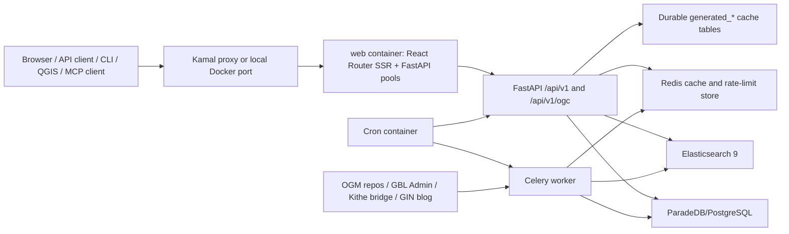

# BTAA Geospatial API Documentation

This directory is the internal handbook for the BTAA Geospatial API platform.
The public API and linked-data site lives in `mkdocs/`; this `docs/` tree is
for developers, operators, maintainers, and project collaborators.

Read this handbook as a sequence when onboarding:

1. Start with this page for the project map and system model.
2. Use [development.md](development.md) to run the local stack.
3. Use [backend/codebase_overview.md](backend/codebase_overview.md) for the
   backend architecture and service boundaries.
4. Use [make_tasks.md](make_tasks.md) for daily commands.
5. Use [backend/testing.md](backend/testing.md) and
   [frontend/testing.md](frontend/testing.md) before changing behavior.
6. Use [backend/kamal_deployment.md](backend/kamal_deployment.md) before
   touching hosted environments.
7. Use the runbooks in `docs/backend/` for domain-specific operations.

## Project Folders

| Path | Purpose |
| --- | --- |
| `backend/` | FastAPI app, API routers, service layer, SQLAlchemy table metadata, database migrations, Celery tasks, ingest/index scripts, backend tests, templates, and static API docs assets. |
| `frontend/` | React 19 / React Router 7 / TypeScript public discovery interface, Vite tooling, component tests, accessibility checks, Tailwind/MUI styling, and browser assets. |
| `cli/` | Python command-line client for searching, reading schemas/facets, fetching resources, validating Aardvark, and using OGC routes. |
| `qgis-plugin/` | QGIS desktop plugin for catalog search and map-loading workflows. |
| `mcp/` | Model Context Protocol stdio, HTTP, and WebSocket bridge helpers and client configuration templates. |
| `mkdocs/` | Public MkDocs Material site for external API specification, linked data, and tutorials. |
| `docs/` | Internal development, architecture, deployment, operations, and maintenance documentation. |
| `config/` | Kamal deploy configuration, destination overrides, cron file, init SQL, and single-host Nginx reference config. |
| `.kamal/` | Kamal hooks and local secret files. Secret files are gitignored operational inputs, not public docs. |
| `performance/` | k6 smoke, stress, and endpoint capacity test assets. |
| `data/`, `logs/`, `tmp/` | Local runtime volumes and generated artifacts. Treat these as environment state. |

## Technology Architecture

The application is a monorepo with a browser app, public API, background
workers, search index, relational store, cache, and auxiliary client tooling.



Core runtime technologies:

| Layer | Current implementation |
| --- | --- |
| API | API 0.8.6 app mounted at `/api/v1`, with custom Swagger at `/api/docs` and OpenAPI JSON at `/api/openapi.json`. |
| Public web app | React 19, React Router 7, TypeScript, Vite 7, MUI 7, Leaflet, GeoBlacklight frontend components, H3 map visualization. |
| Search | Elasticsearch 9.0.0, versioned index build plus alias swap through `scripts/reindex_atomic.py`. |
| Database | ParadeDB/PostgreSQL, SQLAlchemy table metadata in `backend/db/models.py`, script-based migrations in `backend/db/migrations/`. |
| Cache | Redis for hot endpoint/cache coordination plus durable database caches in `generated_api_responses`, `generated_resource_representations`, and generated visual asset tables. |
| Jobs | Celery worker with Redis broker/result backend; Flower for local monitoring. |
| Deployment | Kamal with `web`, `worker`, `cron`, and `flower` roles plus Elasticsearch, ParadeDB, and Redis accessories. |
| Public docs | MkDocs Material under `mkdocs/`, served locally with `make docs-serve` and built with `make docs-build`. |
| Performance tests | Dockerized Grafana k6 scripts under `performance/k6`. |

## Local Docker Stack

The local stack is defined in `docker-compose.yml`.

| Service | Container | Port | Role |
| --- | --- | --- | --- |
| `api` | `btaa-geospatial-api-app` | `127.0.0.1:8000` | FastAPI app, API docs, sitemap/robots, static docs assets. |
| `frontend` | `btaa-geospatial-api-frontend` | `3000` | React Router dev server with mounted source files. |
| `elasticsearch` | `btaa-geospatial-api-elasticsearch` | `127.0.0.1:9200` | Single-node Elasticsearch 9 index. |
| `paradedb` | `btaa-geospatial-api-paradedb` | `127.0.0.1:2345 -> 5432` | PostgreSQL/ParadeDB database. |
| `redis` | `btaa-geospatial-api-redis` | internal | Cache, locks, Celery broker, rate-limit support. |
| `celery_worker` | `btaa-geospatial-api-celery` | internal | Background ingest, indexing, bridge, thumbnail, static-map, and cache tasks. |
| `flower` | `btaa-geospatial-api-flower` | `127.0.0.1:5555` | Celery monitoring UI. |

Start and stop:

```bash
cp .env.example .env
docker compose up -d
docker compose down
```

Local URLs:

- Frontend: `http://localhost:3000`
- API docs: `http://localhost:8000/api/docs`
- OpenAPI JSON: `http://localhost:8000/api/openapi.json`
- Flower: `http://localhost:5555`

## Database Schema Map

The current SQLAlchemy metadata source of truth is `backend/db/models.py`.
Migration scripts are in `backend/db/migrations/` and are run by project
scripts/Make targets rather than Alembic.

Primary table families:

| Family | Tables |
| --- | --- |
| Resource records | `resources` plus BTAA/Aardvark compatibility columns. |
| Relationships | `resource_relationships`. |
| Gazetteers | `gazetteer_geonames`, `gazetteer_wof_spr`, `gazetteer_wof_ancestors`, `gazetteer_wof_concordances`, `gazetteer_wof_geojson`, `gazetteer_wof_names`, `gazetteer_btaa`, `gazetteer_fast`, `gazetteer_fast_embeddings`. |
| Enrichment and visualization | `resource_ai_enrichments`, `resource_allmaps`, `resource_thumbnail_state`, `generated_visual_assets`, `generated_visual_asset_links`, `generated_resource_representations`. |
| Durable API cache | `generated_api_responses`, `generated_api_response_tags`. |
| Resource auxiliary data | `distribution_types`, `resource_distributions`, `resource_downloads`, `resource_licensed_accesses`, `resource_assets`, `resource_data_dictionaries`, `resource_data_dictionary_entries`. |
| API keys and rate limiting | `api_service_tiers`, `api_keys`. |
| Analytics raw events | `analytics_api_usage_logs`, `analytics_searches`, `analytics_search_impressions`, `analytics_events`. |
| Analytics rollups/state | `analytics_daily_api_usage_metrics`, `analytics_daily_search_metrics`, `analytics_daily_resource_metrics`, `analytics_maintenance_state`. |
| OGM harvesting | `ogm_repos`, `ogm_harvest_runs`, `ogm_resource_state`. |
| Kithe bridge sync | `bridge_sync_runs`, `bridge_resource_state`. |
| Homepage content | `gin_blog_posts`. |

When adding or changing a table, update the relevant migration script, tests,
and the domain runbook. If the change introduces a Make target or operator
workflow, update [make_tasks.md](make_tasks.md) in the same change.

## API Surface

Canonical API prefixes:

- Public JSON:API-style routes: `/api/v1`
- OGC API - Records compatibility facade: `/api/v1/ogc`
- Swagger UI: `/api/docs`
- OpenAPI document: `/api/openapi.json`
- Sitemaps and robots: `/sitemap.xml`, `/sitemaps/{filename}.xml`,
  `/robots.txt`

Current public and operational route families:

| Family | Routes |
| --- | --- |
| Root | `GET /api/v1/` |
| Search | `GET /api/v1/search`, `POST /api/v1/search`, `GET /api/v1/search/facets/{facet_name}`, `GET /api/v1/suggest` |
| Resources | `GET /api/v1/resources/`, `GET /api/v1/resources/{id}`, plus resource subroutes for citation, metadata, downloads, distributions, data dictionaries, links, viewer payloads, OGM viewer, relationships, similar items, spatial facets, static maps, and thumbnails. |
| Map and visual assets | `GET /api/v1/map/h3`, `GET /api/v1/static-maps/...`, `GET /api/v1/static-map-assets/{map_hash}`, `GET /api/v1/thumbnails/...`. |
| Gazetteers | Hidden-from-Swagger gazetteer routes under `/api/v1/gazetteers`, including Nominatim, BTAA, GeoNames, and Who's On First search. |
| OGM status | Public `GET /api/v1/ogm/repos` and `GET /api/v1/ogm/harvest/failures`; admin harvest controls under `/api/v1/admin/ogm/...`. |
| Admin | Hidden-from-Swagger Basic Auth routes under `/api/v1/admin` for cache purge, reindexing, API keys, tiers, OGM harvest, bridge sync, blog sync, status, and dump downloads. |
| MCP | `GET /api/v1/mcp` and `POST /api/v1/mcp`. |
| Slack | Hidden `GET /api/v1/slack` and `POST /api/v1/slack/commands`. |
| Turnstile | Hidden status and verification routes under `/api/v1/turnstile`. |
| OGC | `GET /api/v1/ogc/`, `/conformance`, `/collections`, `/collections/btaa-records`, `/queryables`, `/sortables`, `/items`, and `/items/{recordId}`. |

Common parameters:

| Area | Parameters |
| --- | --- |
| Search | `q`, `page`, `per_page`, `sort`, `search_field`, `fields`, `facets`, `meta`, `format`, `callback`, `adv_q`, `include_non_public`, `include_filters`, `exclude_filters`, `fq`. |
| Facets | `facet_name`, `q`, `page`, `per_page`, `sort`, `q_facet`, `adv_q`, `include_non_public`, include/exclude filter params. |
| Resources | `id`, `fields`, `format`, `callback`, `ui_profile`, `variant`, `debug`, `embed`. |
| Map/H3 | `q`, `adv_q`, `bbox`, `resolution`, `include_non_public`, include/exclude filters. |
| OGC | `q`, `bbox`, `datetime`, `limit`, `page`, `sortby`. |
| Admin status | `status`, `limit`, `offset`, `runs_limit`, `include_celery`, `format`, `repo_name`. |

Public-facing endpoint and parameter details should be kept in
`mkdocs/docs/specification/endpoints.md` and
`mkdocs/docs/specification/parameters.md`.

Public OpenAPI routes must declare named Pydantic success response models and
shared JSON error responses. JSON:API resource envelopes, search/facet
pagination metadata, home/blog payloads, OGM status payloads, OGC facade
payloads, MCP metadata, map/H3 payloads, and resource subroute wrappers are
stable contract shapes. JSON:API resource `attributes`, selected `meta` blocks,
metadata field blocks, and relationship/link payload details remain
intentionally extensible so OGM/Aardvark fields and B1G enrichments can evolve
without over-modeling every metadata key.

Public errors use the `{"errors": [...]}` envelope documented in the MkDocs
API specification. The API returns `X-Request-ID` on normal and error
responses; callers may provide that header or let the server generate it. Public
5xx bodies must use safe generic details and must not expose raw exception text,
Elasticsearch query internals, database connection strings, SQL, or upstream
stack details.

## Makefile Command Families

Run Makefile targets from the repository root.

| Family | Targets |
| --- | --- |
| Lint/format/test | `make lint`, `make format`, `make lint-check`, `make test`, `make test-no-coverage`, `make test-fast`, `make test-fresh-db`, `make lint-test`, `make test-pmtiles-network`. |
| Frontend | `make frontend-reset`; direct npm commands run from `frontend/`. |
| CLI | `make cli-test`, `make cli-lint`, `make cli-format`, `make cli-build`, `make cli-man`. |
| Docs | `make docs-serve`, `make docs-build`. |
| Index/search | `make reindex`, `make reindex-benchmark`, `make verify-h3-index`, `make es-unblock`, `make local-clear-search-cache`. |
| Cache and visual assets | `make clear_cache`, `make clear-thumbnail-cache`, `make prime-thumbnail-cache`, `make prime-static-map-cache`, `make prime-resource-cache`, `make prime-visual-caches`, `make refresh-resource-caches`, `make visual-assets-export`, `make visual-assets-import`, `make visual-assets-stream-import`, `make visual-assets-sync-all`. |
| Data import | `make ingest`, `make ingest-featured`, `make populate-distributions`, `make populate-data-dictionaries`, `make backfill-distributions`, `make populate-relationships`, `make resource-aux-init`. |
| OGM | `make ogm-refresh-all`, `make ogm-refresh-repo OGM_REPO_NAME=...`, `make ogm-status`, `make ogm-status-watch`, `make ogm-failures`. |
| Kithe bridge | `make bridge-init`, `make bridge-sync`, `make bridge-sync-batched`, `make bridge-cancel`, `make bridge-status`, `make bridge-status-watch`, `make bridge-failures`. |
| Blog/sitemap | `make blog-sync`, `make sitemap-generate`. |
| Analytics | `make analytics-maintenance`, `make analytics-size-report`. |
| Database sync | `make db-export`, `make db-import`, `make db-sync`, `make gbl-admin-db-*`. |
| Kamal remote ops | `make kamal-reindex`, `make kamal-clear-cache`, `make kamal-verify-h3-index`, `make kamal-blog-sync`, `make kamal-purge-home-blog-cache`, `make kamal-backup-postgres`, `make kamal-backup-elasticsearch`, `make kamal-bridge-sync-batched`, `make kamal-bridge-status`, `make kamal-cron-debug`, `make kamal-worker-logs`, `make kamal-network-sanity`, plus Kamal cache priming targets. |
| Performance | `make k6-smoke`, `make k6-stress`, `make k6-endpoint-capacity`. |

## Kamal Deployment Model

Kamal configuration lives in `config/deploy.yml` with destination overlays in
`config/deploy.dev1.yml`, `config/deploy.dev2.yml`, and `config/deploy.prd.yml`.
Destination secrets are loaded from `.kamal/secrets-common` and
`.kamal/secrets.<dest>` when running Make/Kamal tasks.

Kamal roles:

| Role | Purpose |
| --- | --- |
| `web` | Single-host runtime that starts FastAPI public/internal pools and React Router SSR through `scripts/start_web_singlehost.sh`. |
| `worker` | Celery worker for ingest, cache, bridge, OGM, thumbnail, static-map, and indexing jobs. |
| `cron` | Root cron container that loads `config/crontab` and env values rendered by `scripts/render_cron_env.py`. |
| `flower` | Flower task monitor. |

Accessories:

| Accessory | Image | Storage |
| --- | --- | --- |
| `elasticsearch` | `docker.elastic.co/elasticsearch/elasticsearch:9.0.0` | `/var/lib/btaa-geospatial-api/elasticsearch` |
| `paradedb` | `paradedb/paradedb:0.18.11` | `/var/lib/btaa-geospatial-api/postgres` |
| `redis` | `redis:7.4.6-alpine` | `/var/lib/btaa-geospatial-api/redis` |

Always specify a destination for Kamal commands:

```bash
kamal deploy -d dev1
kamal deploy -d dev2
kamal deploy -d prd
```

Use [backend/kamal_deployment.md](backend/kamal_deployment.md) for host
inventory, bootstrap, deploy, cache, cron, bridge, and storage procedures.

## Current Maintenance Workflows

Daily or per-change:

- Run targeted tests for touched code.
- Run backend `make lint-check` before backend commits.
- Run frontend `npm run lint`, `npm run format:check`, and `npm test` from
  `frontend/` before frontend commits.
- For search/index mapping changes, run `make reindex` and
  `make verify-h3-index`.
- For frontend dependency or Vite config changes, run `make frontend-reset`
  after restarting the Docker frontend.
- For developer-facing workflow changes, update this handbook and
  [make_tasks.md](make_tasks.md).

Weekly operational checks:

- Check OGM status with `make ogm-status` or remote equivalent.
- Check bridge status with `make bridge-status` or `make kamal-bridge-status`.
- Review failed bridge/OGM runs and rerun as needed.
- Run `make analytics-maintenance` where scheduled maintenance is not already
  covering the environment.
- Confirm `/api/docs`, `/api/v1/search?q=minnesota`, `/sitemap.xml`, and the
  frontend search UI respond on active environments.

Quarterly documentation and maintenance checklist:

- Regenerate or review the route inventory from `backend/app/api/**` and update
  `mkdocs/docs/specification/endpoints.md`.
- Review search, resource, OGC, admin, and operational parameters against route
  function signatures and update `mkdocs/docs/specification/parameters.md`.
- Review `backend/db/models.py` and migration scripts for new/removed tables;
  update the schema map here and domain docs.
- Run `rg -n "^[a-zA-Z0-9_-]+:.*##" Makefile` and compare with
  [make_tasks.md](make_tasks.md).
- Run `docker compose config` and compare service names, ports, env vars, and
  volumes with [development.md](development.md).
- Review `config/deploy.yml`, destination overlays, `config/crontab`, and Kamal
  hooks; update [backend/kamal_deployment.md](backend/kamal_deployment.md).
- Build public docs with `make docs-build`.
- Check frontend package scripts and update `docs/frontend/*` if commands or
  test tooling changed.
- Check CLI and QGIS docs after client-facing API changes.
- Review dependency versions and note planned upgrades for Python, Node,
  React Router, Elasticsearch, ParadeDB, Redis, Docker, and Kamal.
- Validate that runbooks still contain concrete verification and rollback steps.

Future upgrade watchlist:

- Keep Elasticsearch 9 mapping/settings runbooks aligned with index migrations
  and versioned alias cutovers.
- Continue hardening durable cache pruning, visual asset sync, and cache warming
  as response volume grows.
- Revisit rate limiting and API key tiers before wider external launch.
- Expand OGC API conformance only as implementation support exists in code.
- Track React Router, Vite, and MUI major/minor upgrades alongside SSR deploy
  behavior.
- Consider moving script-based migrations to a formal migration framework only
  if operational complexity begins to justify the change.
- Reassess production topology if traffic requires separate API, SSR, worker,
  database, Redis, or Elasticsearch hosts.

## Documentation Catalog

Chapter 1, orientation:

- [development.md](development.md) - local setup, Docker services, local
  backend/frontend workflow, ingest/indexing overview.
- [make_tasks.md](make_tasks.md) - root Makefile target reference.
- [cli.md](cli.md) - command-line client usage and development.
- [scripts.md](scripts.md) - repository-level scripts index.
- [external_api_feedback_questions.md](external_api_feedback_questions.md) -
  external API user interview prompt set.

Chapter 2, backend architecture and data:

- [backend/codebase_overview.md](backend/codebase_overview.md)
- [backend/search.md](backend/search.md)
- [backend/caching.md](backend/caching.md)
- [backend/distribution_tables.md](backend/distribution_tables.md)
- [backend/distribution_tables_quick_reference.md](backend/distribution_tables_quick_reference.md)
- [backend/document_distributions_migration.md](backend/document_distributions_migration.md)
- [backend/dct_references_inventory.md](backend/dct_references_inventory.md)
- [backend/relationships.md](backend/relationships.md)
- [backend/spatial_facets.md](backend/spatial_facets.md)
- [backend/h3_pyramid_design.md](backend/h3_pyramid_design.md)
- [backend/btaa_ogm_aardvark.md](backend/btaa_ogm_aardvark.md)

Chapter 3, APIs and integrations:

- [backend/api_keys_and_service_tiers.md](backend/api_keys_and_service_tiers.md)
- [backend/service_tiers_runbook.md](backend/service_tiers_runbook.md)
- [backend/citation_export.md](backend/citation_export.md)
- [backend/gazetteer_api.md](backend/gazetteer_api.md)
- [backend/gazetteer_data_management.md](backend/gazetteer_data_management.md)
- [backend/fast_importer.md](backend/fast_importer.md)
- [backend/llm_service.md](backend/llm_service.md)
- [backend/mcp_integration.md](backend/mcp_integration.md)
- [mcp/README.md](mcp/README.md)
- [mcp/claude_desktop.md](mcp/claude_desktop.md)
- [slack/README.md](slack/README.md)
- [ogc-records-facade.md](ogc-records-facade.md)

Chapter 4, ingest, migration, and operations:

- [backend/ogm_harvesting.md](backend/ogm_harvesting.md)
- [backend/old_database_migration.md](backend/old_database_migration.md)
- [backend/migrate_solr_data.md](backend/migrate_solr_data.md)
- [backend/scripts.md](backend/scripts.md)
- [backend/analytics_program.md](backend/analytics_program.md)
- [backend/turnstile.md](backend/turnstile.md)
- [backend/deploy_elasticsearch_changes.md](backend/deploy_elasticsearch_changes.md)
- [backend/elasticsearch_production.md](backend/elasticsearch_production.md)
- [backend/performance_testing.md](backend/performance_testing.md)
- [backend/k6_stress_comparison_2026-05-05.md](backend/k6_stress_comparison_2026-05-05.md)
- [backend/k6_launch_readiness_dev2_2026-05-06.md](backend/k6_launch_readiness_dev2_2026-05-06.md)

Chapter 5, deployment and recovery:

- [backend/kamal_deployment.md](backend/kamal_deployment.md)
- [backend/disaster_recovery.md](backend/disaster_recovery.md)
- [production_server_requirements.md](production_server_requirements.md)
- [backend/vm_memory_recovery.md](backend/vm_memory_recovery.md)
- [backend/IP_WHITELISTING_RECOMMENDATIONS.md](backend/IP_WHITELISTING_RECOMMENDATIONS.md)
- [backend/CLIENT_SIDE_API_KEYS_EXPLAINED.md](backend/CLIENT_SIDE_API_KEYS_EXPLAINED.md)

Chapter 6, frontend:

- [frontend/README.md](frontend/README.md)
- [frontend/testing.md](frontend/testing.md)
- [frontend/testing-quick-reference.md](frontend/testing-quick-reference.md)
- [frontend/linting-and-formatting.md](frontend/linting-and-formatting.md)
- [frontend/linting-quick-reference.md](frontend/linting-quick-reference.md)
- [frontend/homepage-map.md](frontend/homepage-map.md)

Chapter 7, testing:

- [backend/testing.md](backend/testing.md)
- [frontend/testing.md](frontend/testing.md)
- [../backend/tests/README.md](../backend/tests/README.md)

Chapter 8, public docs:

- `mkdocs/docs/index.md`
- `mkdocs/docs/specification/*.md`
- `mkdocs/docs/linked-data/*.md`
- `mkdocs/docs/specification/tutorial/*.md`
- `mkdocs/docs/includes/requests/*.md`
