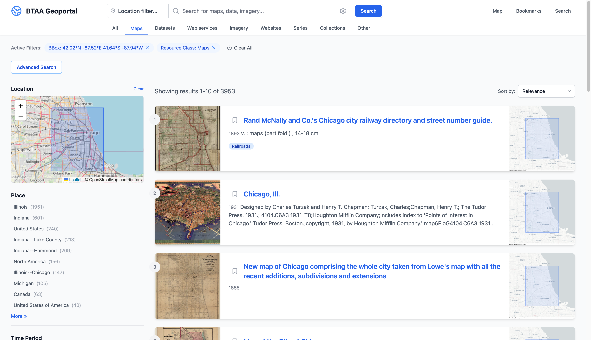

# rui
React UI for our exploratory data api



## Development

Install dependencies:
```bash
npm install
```

Configure the database:
```bash
cp .env.example .env
```

Run the server:
```bash
npm run dev
```

Push to the gh-pages branch:
```bash
npm run deploy
```

Lint the code:
```bash
npm run lint
```

Fix lint errors:
```bash
npm run lint:fix
```

Format the code:
```bash
npm run format
```

Check formatting:
```bash
npm run format:check
```

## Todos

- [ ] Item View - Catch up to BTAA redesign
- [ ] Item View - Tabbed interface (Item View | Map Overlay | Metadata | API)
- [ ] Item View - Downloads (more options, more prominently displayed)
- [ ] Item View - Metadata tab (ISO, FGDC,JSON)
- [ ] Item View - Relations
- [ ] Item View - Code snippets
- [ ] Item View - Relations
- [ ] Item View - More like this panel
- [ ] Item View - Social media meta tags
- [ ] Item View - Add a "share" icon
- [ ] Design - Make the application themeable
- [ ] App - Progressive Web App

